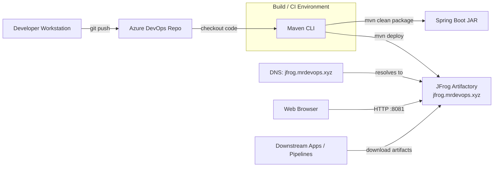

## Maven – JFrog Artifactory Integration (DevOps)

This document captures the hands-on work done to integrate **Maven** with **JFrog Artifactory** and **Azure DevOps Git**, focusing on artifact versioning, private repository publishing, and a production-style DevOps workflow.

---

### 1. End-to-End README-Style Summary

**Goal**

- Build and package a Spring Boot application with Maven.
- Manage artifact versions using the Maven Versions Plugin.
- Publish artifacts into JFrog Artifactory, reachable at `jfrog.mrdevops.xyz`.
- Track source in Azure DevOps and prepare to host in GitHub.

**Key Steps**

- Validated Maven installation and Java 17+.
- Verified and built the project from `pom.xml`.
- Used `mvn versions:set` to move from `SNAPSHOT` to release versions.
- Configured Maven authentication (`settings.xml`) and distribution management (`pom.xml`).
- Deployed multiple artifact versions to Artifactory and verified them in the UI.
- Pushed source to Azure DevOps and prepared for GitHub hosting.

---

### 2. DevOps Workflow Explanation

- **Source Management**
  - Code for the Spring Boot application is maintained in Git.
  - Developers commit and push to Azure DevOps (and can mirror/push to GitHub), providing a single source of truth.

- **Build & Versioning**
  - Maven drives the lifecycle:
    - `mvn validate` checks `pom.xml` and project structure.
    - `mvn clean package` compiles code, runs tests, and builds a JAR in `target/`.
  - The **Maven Versions Plugin** updates the project version:
    - `mvn versions:set -DnewVersion=1.0.0`
    - `mvn versions:set -DnewVersion=1.0.1`
  - This creates clear, traceable release artifacts (`1.0.0`, `1.0.1`, etc.).

- **Artifact Publishing to Artifactory**
  - Maven uses credentials from `~/.m2/settings.xml`:

    ```xml
    <settings>
      <servers>
        <server>
          <id>central</id>
          <username>admin</username>
          <password>password</password>
        </server>
        <server>
          <id>snapshots</id>
          <username>admin</username>
          <password>password</password>
        </server>
      </servers>
    </settings>
    ```

  - Artifact destinations are defined in `pom.xml`:

    ```xml
    <distributionManagement>
      <repository>
        <id>central</id>
        <url>http://jfrog.mrdevops.xyz:8081/artifactory/libs-release-local</url>
      </repository>
      <snapshotRepository>
        <id>snapshots</id>
        <url>http://jfrog.mrdevops.xyz:8081/artifactory/libs-snapshot-local</url>
      </snapshotRepository>
    </distributionManagement>
    ```

  - During `mvn clean deploy`, Maven uploads artifacts to `libs-release-local` or `libs-snapshot-local`. These are then visible and manageable in the Artifactory UI.

- **Infrastructure, Networking & Health**
  - DNS is configured so `jfrog.mrdevops.xyz` resolves to the Artifactory server IP.
  - Artifactory health is verified via:

    ```bash
    curl http://jfrog.mrdevops.xyz:8081/artifactory/api/system/ping
    # Expected output: OK
    ```

  - Service logs were reviewed; entitlement-related 404 warnings were identified as expected in Artifactory OSS and do not affect core artifact management.

- **Consumption & CI/CD**
  - Other projects and CI/CD pipelines consume artifacts from Artifactory using the configured coordinates and versions.
  - Azure DevOps (and GitHub Actions later) can automate:
    - Checkout → Maven build → Version bump → Deploy to Artifactory → Integration tests.

---

### 3. Architecture Diagram (Mermaid)



---

### 4. Practicals / Hands-On Exercises (Maven + JFrog)

This section documents the concrete exercises executed during the integration.

#### Practical 1: Verify Maven Installation

- **Command**

  ```bash
  mvn -version
  ```

- **Expected Output**
  - Maven version displayed.
  - Java version 17+.
  - Correct `JAVA_HOME` path.

✔ Confirms Maven and Java are correctly configured.

---

#### Practical 2: Validate `pom.xml` Configuration

- **Command**

  ```bash
  mvn validate
  ```

- **Outcome**
  - Ensures `pom.xml` syntax is correct.
  - Verifies project metadata (`groupId`, `artifactId`, `version`).
  - Fails early if dependency definitions are invalid.

✔ Confirms project structure is Maven-compliant.

---

#### Practical 3: Build the Spring Boot Application

- **Command**

  ```bash
  mvn clean package
  ```

- **What Happens**
  - Downloads dependencies from Maven Central.
  - Compiles Java source files.
  - Packages application into a `.jar` file.

- **Verification**

  ```bash
  ls target/
  ```

✔ Artifact generated under `target/`.

---

#### Practical 4: Run Application Locally

- **Command**

  ```bash
  java -jar target/*.jar
  ```

- **Verification**
  - Application starts successfully.
  - Accessible on configured port (e.g., `8080`).

✔ Confirms build artifact is runnable.

---

#### Practical 5: Version Management Using Maven Versions Plugin

- **Update Version**

  ```bash
  mvn versions:set -DnewVersion=1.0.0
  ```

- **Verify Version**

  ```bash
  grep "<version>" pom.xml
  ```

- **Cleanup Backup Files**

  ```bash
  rm pom.xml.versionsBackup
  ```

✔ Demonstrates controlled artifact versioning.

---

#### Practical 6: Verify Artifactory Health

- **Command**

  ```bash
  curl http://jfrog.mrdevops.xyz:8081/artifactory/api/system/ping
  ```

- **Expected Output**

  ```text
  OK
  ```

✔ Confirms Artifactory service is healthy.

---

#### Practical 7: Configure Maven Authentication for JFrog

- **File**

  `~/.m2/settings.xml`

  ```xml
  <servers>
    <server>
      <id>central</id>
      <username>admin</username>
      <password>password</password>
    </server>
  </servers>
  ```

✔ Enables Maven to authenticate with JFrog.

---

#### Practical 8: Configure Distribution Management in `pom.xml`

```xml
<distributionManagement>
  <repository>
    <id>central</id>
    <url>http://jfrog.mrdevops.xyz:8081/artifactory/libs-release-local</url>
  </repository>
  <snapshotRepository>
    <id>snapshots</id>
    <url>http://jfrog.mrdevops.xyz:8081/artifactory/libs-snapshot-local</url>
  </snapshotRepository>
</distributionManagement>
```

✔ Directs Maven where to publish artifacts.

---

#### Practical 9: Deploy Artifact to JFrog Artifactory

- **Command**

  ```bash
  mvn clean deploy
  ```

- **Verification**
  - Artifact visible in JFrog UI.
  - Repository: `libs-release-local` or `libs-snapshot-local`.

✔ Confirms successful Maven → JFrog integration.

---

#### Practical 10: Incremental Artifact Versioning

- **Commands**

  ```bash
  mvn versions:set -DnewVersion=1.0.1
  mvn clean deploy
  ```

✔ Demonstrates multiple version deployments.

---

#### Practical 11: Azure DevOps Repository Push

- **Commands**

  ```bash
  git init
  git add .
  git commit -m "Initial Maven-JFrog integration"
  git remote add origin <ssh-url>
  git push -u origin master
  ```

✔ Source code stored securely in Azure DevOps.

---

### 5. LinkedIn Post (Ready to Copy)

Today I completed a full, hands-on integration of **Maven** with **JFrog Artifactory** as part of a DevOps practice lab.

I started by validating and building a Spring Boot Maven project (`mvn validate`, `mvn clean package`), then used the **Maven Versions Plugin** to move from `SNAPSHOT` builds to clean release versions. Next, I configured Maven authentication in `~/.m2/settings.xml`, added `<distributionManagement>` entries in `pom.xml`, and published multiple versions of the application to Artifactory, accessing them via a custom endpoint at `jfrog.mrdevops.xyz` and verifying them through the Artifactory UI and health checks.

All of this is tracked in an Azure DevOps Git repository, making the setup ready for CI/CD pipelines that go from source to built artifacts stored in a private repository. **Executed end-to-end Maven–JFrog integration including artifact versioning, secure authentication, and private repository publishing with Azure DevOps as the source-of-truth.**

